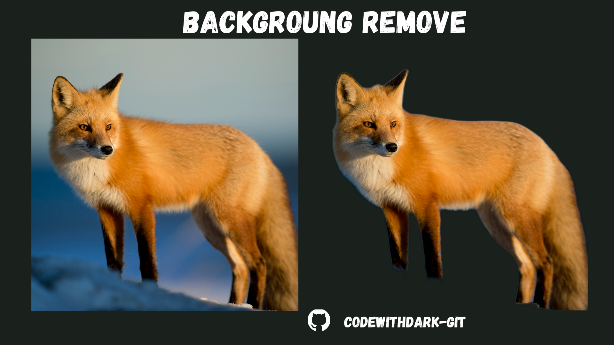
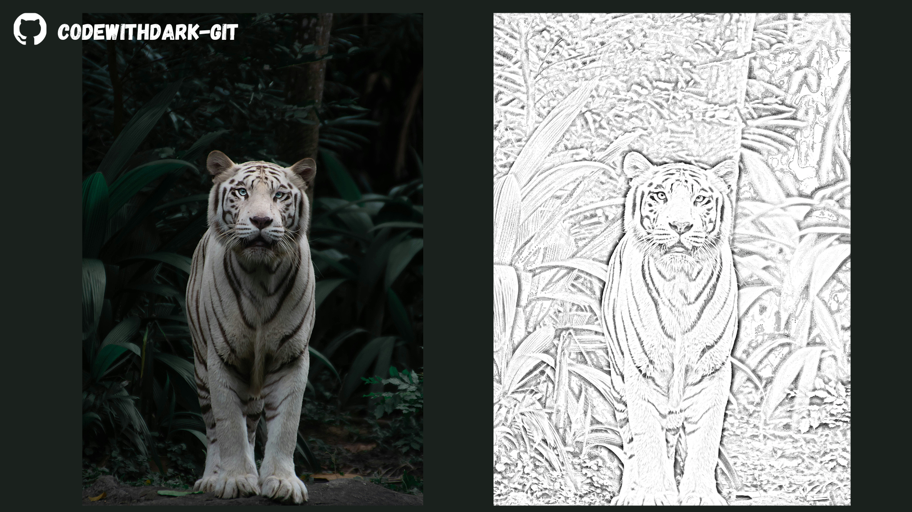

# 🎨 PixWizard

PixWizard is a lightweight, powerful image processing web application built using **Streamlit**. It enables users to perform quick image transformations such as background removal and pencil sketch generation — all in your browser with no installations or design tools needed.

---

## 🚀 Features

| Feature                   | Description                                                                 |
|--------------------------|-----------------------------------------------------------------------------|
| 🧼 Background Removal     | Uses AI to cleanly remove backgrounds using the `rembg` library.            |
| ✏️ Pencil Sketch Effect   | Converts photos to hand-drawn-style pencil sketches with OpenCV.           |
| 🔍 Image Search (Optional)| Search reference images online from Unsplash (*demo scraping version*).     |
| 💾 Download Support       | Download the processed image in PNG format instantly.                      |

---

## 🖼️ Demo Screenshots

### Remove Background


### Pencil Sketch


---

## 🛠️ How It Works

### 📦 Technology Stack

- **Streamlit** - UI framework
- **rembg** - Background removal via deep learning
- **OpenCV** - Pencil sketch transformation
- **Pillow (PIL)** - Image handling
- **NumPy** - Array manipulation
- **Requests + BeautifulSoup** - Optional image search scraping

---

## 🧪 Installation

> To run PixWizard locally on your machine:

### 🔧 Step-by-step

1. **Clone the repository**  
```bash
git clone https://github.com/your-username/pixwizard.git
cd pixwizard
